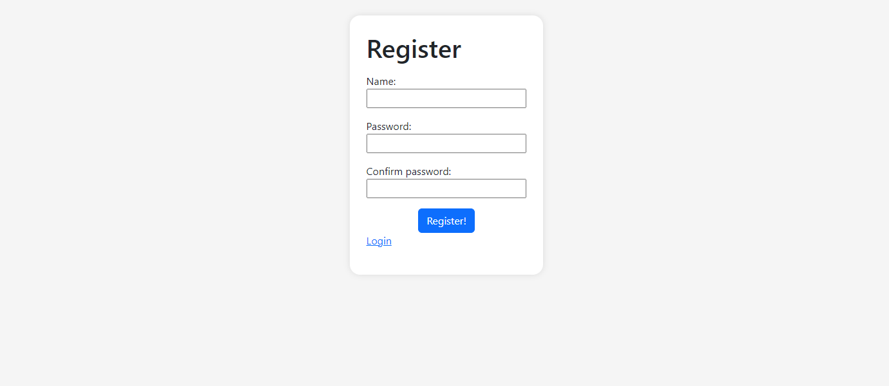

# PHP and MySQL login system

This is a web application that runs an login and register page, and it uses PHP sessions to store variables and set prvate routes

#

This app was made with:
- PHP
- MySQL
- Bootstrap

## TODO

- [ ] Set a hash algorithm to store and read passwords

### Register page

### Dashboard page

